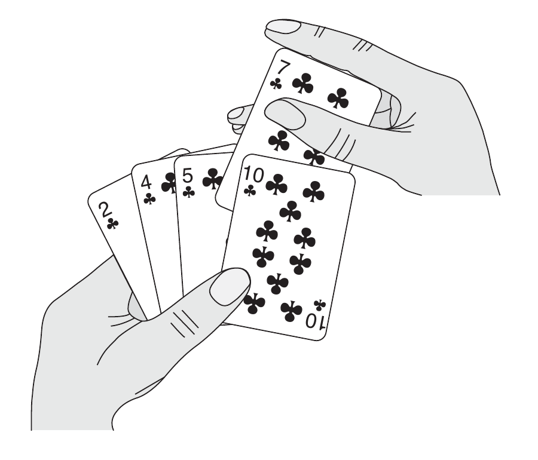
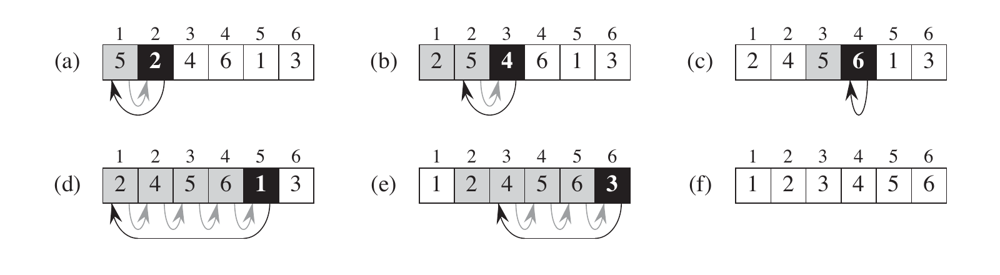

# 2 Primeros pasos

Este capítulo te familiarizará con el marco de trabajo que usaremos a lo largo de este libro para trabajar en el diseño y análisis de algoritmos. Es autocontenido, pero incluye muchas referencias de material que introduciremos en el Capítulo 3 y 4. (También contiene muchas sumatorias, para las cuales el Apéndice A muestra cómo resolver).

Comenzamos por examinar el algoritmo de ordenamiento por inserción para resolver el problema de ordenamiento introducido en el Capítulo 1. Definimos "pseudocódigo" que podría ser familiar para ti si has hecho programación alguna vez, y lo usamos para mostrar cómo debemos especificar nuestros algoritmos. Habiendo especificado el algoritmo de ordenamiento por inserción, pasamos a comprobar que ordena correctamente, y analizamos su tiempo de ejecución. El análisis agrega una notación que se enfoca en cómo ese tiempo incrementa con el número de elementos a ser ordenados. Continuando nuestra discusión del ordenamiento por inserción, introducimos el enfoque de dividir y conquistar para diseño de algoritmos y lo usamos para desarrollar un algoritmo llamado ordenamiento por fusión. Terminamos con un análisis del tiempo de ejecución del ordenamiento por fusión.

## 2.1 Ordenamiento por inserción

Nuestro primer algoritmo, el de ordenamiento por inserción, resuelve el problema de ordenamiento introducido en el Capítulo 1:

**Entrada:** Una secuencia de $n$ números $\langle a_1, a_2,\dots, a_n \rangle$.

**Salida:** Una permutación (reordenamiento) $\langle a'_1, a'_2, \dots, a'_n \rangle$ de la secuencia de entrada tal que $a'_1 \leq a'_2 \leq \dots \leq a'_n$.

Los números que queremos ordenar también son conocidos como **keys**. Aunque conceptualmente estamos ordenando una secuencia, la entrada nos llega en la forma de un arreglo con $n$ elementos.

En este libro, normalmente describimos algoritmos como programas escritos en **pseudocódigo** que es similar en muchos aspectos a C, C++, Java, Python o Pascal. Si conoces sobre cualquiera de estos lenguajes, no deberías tener dificultades leyendo nuestros algoritmos. Lo que separa al pseudocódigo del código "real" es que, en pseudocódigo empleamos cualquier método de expresión que sea más claro y conciso para especificar un algoritmo dado. Algunas veces, el método más claro es el inglés, así que no te sorprendas si te cruzas con una frase o una oración en inglés incorporada sin una sección de código "real". Otra diferencia entre pseudocódigo y código real es que el pseudocódigo por lo general no se ocupa de cuestiones de ingeniería de software. Aspectos de abstracción de datos, modularidad, y gestión de errores son regularmente ignorados con el propósito de transmitir la esencia del algoritmo más concisamente.

Comenzamos con el **ordenamiento por inserción,** el cual es un algoritmo eficiente para ordenar un número pequeño de elementos. El ordenamiento por inserción trabaja de la manera en que mucha gente ordena su mano en un juego de cartas. Comenzamos con la mano izquierda vacía y las cartas boca abajo en la mesa. Después, retiramos de la mesa una carta a la vez y la añadimos a la mano izquierda. Para encontrar la posición correcta de una carta, la comparamos con cada una de las cartas que ya tengamos en la mano de derecha a izquierda, como se ilustra en la Figura 2.1.



**Figura 2.1** Ordenamiento de una mano de cartas usando el método por inserción.

En todo momento, las cartas mantenidas en la mano izquierda están ordenadas, y esas cartas estaban originalmente en la cima de la pila de cartas en la mesa.

Presentamos nuestro pseudocódigo para el ordenamiento por inserción como un procedimiento llamado $ORDENAMIENTO-INSERCION$, que toma como parámetro un arreglo $A[1..n]$ conteniendo una secuencia de tamaño $n$ que tiene que ser acomodada en orden. (En el código, el número $n$ de elementos en $A$ es denotado por $A.length.$) El algoritmo ordena los números de entrada **en su lugar**: reordena los números dentro del arreglo $A$, con por lo mucho un número constante de ellos guardados fuera del arreglo en cualquier momento. El arreglo de entrada $A$ contiene la secuencia ordenada de salida cuando el procedimiento $ORDENAMIENTO-INSERCION$ termina.



**Figura 2.2** La operación ORDENAMIENTO-INSERCION en el arreglo $A = \langle 5, 2, 4, 6, 1, 3 \rangle$. Los índices aparecen sobre los rectángulos, y los valores guardados en las posiciones del arreglo aparecen dentro de los rectángulos. **(a)-(e)** Las iteraciones del bucle **for** en las líneas 1-8. En cada iteración, el rectángulo negro guarda la *key* tomada de $A[j]$, el cual es comparado con los valores sombreados a su izquierda en la prueba de la línea 5. Las flechas sombreadas muestran valores del arreglo que se movieron una posición a la derecha en la línea 6, y las flechas negras indican dónde se posiciona *key* en la línea 8. **(f)** El arreglo final ordenado.

```text
ORDENAMIENTO-INSERCION (A)
1   for j = 2 to A.length
2       key = A[j]
3       // Inserta A[j] dentro de la secuencia odenada A[1..j - 1].
4       i = j - 1
5       while i > 0 and A[i] > key
6           A[i + 1] = A[i]
7           i = i - 1
8       A[i + 1] = key
```

### Invariantes de bucle y la exactitud del ordenamiento por inserción

La figura 2.2 nos muestra cómo este algoritmo funciona para $A = \langle 5, 2, 4, 6, 1, 3 \rangle$. El índice $j$ indica la "carta actual" siendo agregada a la mano. Al comienzo de cada iteración para el bucle **for**, el cual es indexado por $j$, el subarreglo que consta de los elementos $A[1..j - 1]$ constituye las cartas ordenadas actualmente en la mano, y el subarreglo restante $A[j + 1..n]$ corresponde a la pila de cartas que siguen en la mesa. De hecho, los elementos $A[1..j - 1]$ son los elementos *originalmente* en la posición 1 a $j - 1$, pero ahora de forma ordenada. Denominamos a estas propiedades de $A[1..j - 1]$ formalmente como una **invariante de bucle:**

Al comienzo de cada iteración para el bucle **for** de las líneas 1-8, el subarreglo $A[1..j - 1]$ consta de los elementos originalmente en $A[1..j - 1]$, pero de forma ordenada.

Utilizamos invariantes de bucle para ayudarnos a entender por qué un algoritmo es correcto. Debemos mostrar tres propiedades acerca de una invariante de bucle:

**Inicialización:** Es cierto antes de la primera iteración del bucle.

**Mantenimiento:** Si es cierto antes de una iteración del bucle, permanece cierto antes de la siguiente iteración.

**Terminación:** Cuando el bucle finaliza, la invariante nos da una propiedad útil que ayuda a mostrar que el algoritmo es correcto.

Cuando las primeras dos propiedades se mantienen, la invariante del bucle es cierta antes de cada iteración del bucle. (Claro, somos libres de usar hechos establecidos fuera de la invariante del bucle misma para probar que la invariante de bucle permanece cierta antes de cada iteración.) Nota la similitud a la inducción matemática, donde para probar que una propiedad se mantiene, pruebas un caso base y un caso inductivo. Aquí, mostrar que la invariante se mantiene antes de cada iteración corresponde al caso base y mostrar que la invariante se mantiene de iteración a iteración corresponde al caso inductivo.

La tercera propiedad es, tal vez, la más importante, pues estamos usando la invariante de bucle para mostrar la exactitud. Típicamente, usamos la invariante de bucle junto con la condición que causó la terminación del bucle. La propiedad de terminación es diferente a como normalmente la usamos en la inducción matemática, en la que aplicamos el caso inductivo indefinidamente; aquí, detenemos la "inducción" cuando el bucle termina.

Veamos cómo estas propiedades se mantienen para el ordenamiento por inserción.

**Inicialización:** Comenzamos por mostrar que la invariante de bucle se mantiene antes de la primera iteración, cuando $j = 2$.[^1] El subarreglo $A[1..j - 1]$, entonces, consiste simplemente del elemento $A[1]$ que es, de hecho, el elemento original en $A[1]$. Además, este subarreglo está ordenado (trivialmente, claro), lo que nos muestra que la invariante de bucle se mantiene antes de la primera iteración del bucle.

[^1]: Cuando el bucle es un bucle **for**, el momento en el que verificamos la invariante de bucle justo antes de la primera iteración está inmediatamente después de la asignación inicial a la variable contador del bucle y justo antes de la primera prueba en el encabezado del bucle. En el caso de `ORDENAMIENTO-INSERCION`, esta vez está después de la asignación de 2 a la variable *j* pero antes de la primera prueba que determina *j* ≤ *A.length*.

**Mantenimiento:** Después, abordamos la segunda propiedad: mostramos que cada iteración mantiene la invariante del bucle. Informalmente, el cuerpo del bucle **for** funciona moviendo $A[j - 1]$, $A[j - 2]$, $A[j - 3]$, y así en una posición a la derecha hasta que encuentre la posición apropiada para $A[j]$ (líneas 4-7), en la cual inserta el valor de $A[j]$ (línea 8). El subarreglo $A[1..j]$ entonces, consiste de los elementos originalmente en $A[1..j]$, pero acomodados en orden. El incremento de $j$ para la siguiente iteración del bucle **for** entonces preserva la invariante de bucle.

Un trato más formal de la segunda propiedad requeriría declarar y mostrar una invariante de bucle para el bucle **while** de las líneas 5-7. De cualquier manera, en este punto preferimos no estancarnos en tal formalismo, asimismo confiamos en nuestro análisis informal para mostrar que la segunda propiedad se mantiene para el bucle externo.

**Terminación:** Finalmente, examinamos qué pasa cuando el bucle termina. La condición que causa que el bucle **for** termine es $j > A.length = n$. Debido a que cada iteración del bucle incrementa $j$ en 1, debemos tener $j = n + 1$ en ese momento. Sustituyendo $n + 1$ **for** $j$ en la redacción de la invariante de bucle, tenemos que el arreglo $A[1..n]$ consta de elementos originalmente en $A[1..n]$, pero acomodados en orden. Si observamos que el subarreglo $A[1..n]$ es el arreglo completo, concluimos que el arreglo entero está ordenado. Por lo tanto, el algoritmo es correcto.

Usaremos este método de la invariante de bucle para mostrar la exactitud posteriormente en este capítulo, así como en otros capítulos también.

### Convenciones en pseudocódigo

Usamos las siguientes convenciones en nuestro pseudocódigo

- La indentación indica estructuras de bloques. Por ejemplo, el cuerpo del bucle **for** que comienza en la línea 1 consiste de las líneas 2-8, y el cuerpo del bucle **while** que comienza en la línea 5 contiene las líneas 6-7 pero no la línea 8. Nuestro estilo de indentación aplica también a las declaraciones **if-else**[^2]. Usando indentación en lugar de los indicadores convencionales de estructras de bloques, tales como las declaraciones **begin** y **end**, reduce enormemente el desorden mientras conserva, o incluso mejora, la claridad.[^3]

[^2]: En una declaración **if-else**, se indenta **else** al mismo nivel que su par **if**. A pesar de que omitimos la palabra clave **then**, muy ocasionalmente nos referimos a la porción ejecutada cuando la prueba que sigue a **if** es verdadera como una **cláusula then**. Para pruebas multi cláusula, usamos el **elseif** para las demás pruebas después de la primera.

[^3]: Cada procedimiento en pseudocódigo en este libro aparece en una sola página, de manera que no tendrás que discernir niveles de indentación en código separado entre páginas.

- La estructura de bucle **while**, **for**, y **repeat-until** y la estructura condicional **if-else** tienen interpretaciones similares a los de C, C++, Java, Python y Pascal.[^4] En este libro, el contador del bucle conserva su valor después de salir del bucle, a diferencia de algunas situaciones que aparecen en C++, Java, y Pascal. De este modo, inmediatamente después de un bucle **for**, el valor del contador del bucle es el primer valor que exceda el límite del bucle **for**. Usamos esta propiedad en nuestros argumentos de exactitud para el ordenamiento por inserción. El encabezado del bucle **for** en la línea 1 es **for** $j = 2$ **to** $A.length$, y cuando este bucle termina, $j = A.length + 1$ (o, su equivalente, *j* = *n* + 1, siendo *n* = *A.length*). Usamos la palabra clave **to** cuando el bucle **for** incrementa su contador de bucle en cada iteración, y usamos la palabra clave **downto** cuando el bucle **for** decrece su contador de bucle. Cuando el contador de bucle cambia por una cantidad mayor a 1, la cantidad a cambiar sigue de la palabra clave opcional **by**.

[^4]: La mayoría de los lenguajes de estructuras de bloque tienen estructuras equivalentes, aunque la sintaxis puede ser diferente. Python carece de bucles **repeat-until**, y su bucle **for** opera un poco diferente al bucle **for** en este libro.

- El símbolo "//" indica que el resto de la línea es un comentario.

- Una asignación múltiple en la fórmula $i = j = e$ asigna a ambas variables $i$ y $j$ el valor de la expresión $e$; debería ser tratada como equivalente a la asignación de $j = e$ seguida por la asignación de $i = j$.

- Las variables (tales como $i$, $j$, y $key$) son locales al procedimiento dado. No usaremos variables globales sin una indicación explícita.

- Accedemos a los elementos del arreglo especificando el nombre del arreglo seguido del índice dentro de corchetes. Por ejemplo, $A[i]$ indica el $i$ésimo elemento del arreglo $A$. La notación ".." es usada para indicar un rango de valores sin un arreglo. De este modo, $A[1..j]$ indica el subarreglo $A$ conteniendo $j$ elementos: $A[1], A[2],...,A[j]$.

- Normalmente organizamos datos compuestos en **objetos**, los cuales están compuestos de **atributos**. Accedemos a un atributo particular usando la sintaxis encontrada en la mayoría de lenguajes de programación orientada a objetos: el nombre del objeto, seguido de un punto, seguido del nombre del atributo. Por ejemplo, tratamos un arreglo como un objeto con el atributo $length$ indicando cuántos elementos contiene. Para especificar el número de elementos en un arreglo $A$, escribimos $A.length$.\
Tratamos una variable que representa un arreglo u objeto como un puntero de los datos que representan el arreglo u objeto. Para todos los atributos $f$ de un objeto $x$, establecer $y = x$ causa $y.f$ para igualar $x.f$. Además, si ahora asignamos $x.f = 3$, entonces no solo $x.f$ equivale a 3, sino que también $y.f$ equivale a 3. En otras palabras, $x$ y $y$ apuntan al mismo objeto después de la asignación $y = x$.\
Nuestra notación de atributos puede ser en "cascada". Por ejemplo, supongamos que el atributo $f$ es por sí solo un puntero a algún tipo de objeto que tiene un atributo $g$. Entonces la notación $x.f.g$ está implícitamente entre paréntesis como $(x.f).g$. En otras palabras, si tenemos asignada $y = x.f$, entonces $x.f.g$ es lo mismo que $y.g$.\
A veces, un puntero no apuntará a ningún objeto en absoluto. En este caso, le damos el valor especial $NIL$.

- Le pasamos parámetros a un procedimiento **por valor**: El procedimiento mencionado recibe su propia copia de parámetros, y si asigna valores a un parámetro, el cambio *no* es visto por el procedimiento que realiza la llamada. Cuando se pasan los objetos, el puntero hacia los datos que representa el objeto es copiado, pero no los atributos del objeto. Por ejemplo, si $x$ es un parámetro de un procedimiento que es llamado, la asignación de $x = y$ dentro del procedimiento llamado no es visible para el procedimiento que hace el llamado. Sea como sea, la asignación de $x.f = 3$ sí es visible. De manera similar, los arreglos los pasamos como punteros, de modo que se pasa un puntero del arreglo en lugar de el arreglo entero, y los cambios de los elementos individuales del arreglo son visibles para el procedimiento que hace el llamado.

- Una sentencia **return** transfiere el control de vuelta inmediatamente al punto de llamada en el procedimiento que hace la llamada. La mayoría de sentencias **return** también toman un valor para devolverlo al que hace la llamada. Nuestro pseudocódigo difiere de muchos lenguajes de programación en que permitimos que múltiples valores sean devueltos en una sola sentencia **return**.

- Los operadores booleanos "y" y "o" causan un **cortocircuito**. Es decir, cuando evaluamos la expresión "$x$ y $y$" primero evaluamos "$x$". Si "$x$" se evalúa como $FALSO$, entonces la expresión entera no se puede evaluar en $VERDADERO$ y, por tanto, no evaluamos $y$. Si, por otro lado, $x$ se evalúa en $CIERTO$, debemos evaluar $y$ para determinar el valor de la expresión entera. De manera similar, en la expresión "$x$ o $y$" evaluamos la expresión $y$ solo si $x$ se evalúa en $FALSO$. Los operadores de cortocircuito nos permiten escribir expresiones booleanas tales como "$x \neq NIL$ y $x.f = y$" sin preocuparnos acerca de lo que pasa cuando tratamos de evaluar $x.f$ cuando $x$ es $NIL$.

- La palabra clave **error** indica que ocurrió un error porque las condiciones eran incorrectas para el procedimiento que ha sido llamado. El procedimiento que hace la llamada es responsable de manejar los errores, y por lo tanto no especificamos qué acción tomar.

### Ejercicios

#### 2.1-1

Usando la Figura 2.2 como modelo, ilustra la operación de $ORDENAMIENTO-INSERCION$ en el arreglo $A = \langle 31, 41, 59, 26, 41, 58 \rangle$.

#### 2.1-2

Recrea el procedimiento $ORDENAMIENTO-INSERCION$ para ordenar en un orden no creciente en lugar de uno no decreciente.

#### 2.1-3

Toma en cuenta el **problema de búsqueda**:

**Entrada:** Una secuencia de $n$ números $A = \langle a_1, a_2,..., a_n \rangle$ y un valor $v$.

**Salida:** Un índice $i$ tal que $v = A[i]$ o el valor especial $NIL$ si $v$ no aparece en $A$.

Escribe un pseudocódigo para una **búsqueda lineal**, que recorra toda la secuencia buscando $v$. Usando una invariante de bucle, prueba que tu algoritmo es correcto. Asegúrate de que tu invariante de bucle cumple con las tres propiedades necesarias.

#### 2.1-4

Considera el problema de añadir dos *n*-bit números binarios enteros, guardados en dos arreglos con *n*-elementos $A$ y $B$. La suma de los dos números enteros debe ser guardada en formato binario en un arreglo de $(n+1)$-elementos $C$. Declara el problema formalmente y escribe un pseudocódigo para añadir los dos números enteros.

## 2.2 Analizando algoritmos

***Analizar*** un algoritmo ha llegado a significar predecir los recursos que el algoritmo requiere. Ocasionalmente, recursos como la memoria, el ancho de banda de comunicación, o hardware de procesamiento son de principal importancia.

-- TODO : Continuar en la página 23